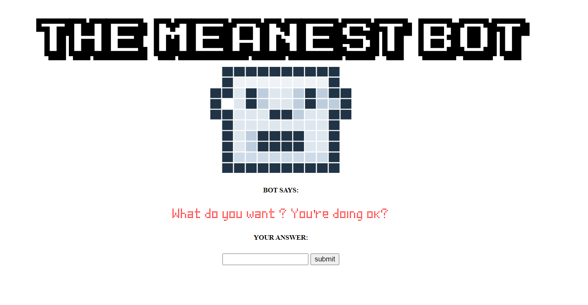

# chat-bot-teamwork
Type of challenge: **Team work**  
Duration : **3 days**  
Team challenge: **3**

# **Our ChatBot : "The Meanest Bot".** 
**1.L'équipe.**
  Noémie, Kévin, Matt.

**2.Choix du projet.**
 Nous vous présentons notre chatbot : ["The Meanest Bot"](https://mattnannetti.github.io/chat-bot-teamwork/). 
 Nous avons choisi de développer un chatbot car l'interaction entre l'utilisateur et le code nous semblait intéressant à comprendre. 
Notre but est d'améliorer notre compréhension de Javascript et de l'appliquer à une situation concrète.

**3.Projet.**
 a. *Maquette.*
 On a fait un plan du fonctionnement de notre code et une maquette visuelle du site.

b. *Répartition des tâches.*
 Une partie de l'équipe a été mise en charge de l'HTML/CSS tandis que le reste s'occupait de commencer le README et de réfléchir au code Javascript.
Voici ici notre première version HTML/CSS :
  

c. *Code.*
 Une fois le HTML fait, on s'est penché ensemble sur le code qu'on a écrit à trois. 

d. *Animation et son.*
 Une fois le code écrit, on s'est penché sur comment le rendre plus vivant. On a donc rajouté des animations et des sons.

**4.Problèmes rencontrés.**
- Boucle au clic.
- Fonction clic avec Enter.

**5.Chatbot fini.**
 Voici le visuel de la version finale de notre chatbot ! :
  

